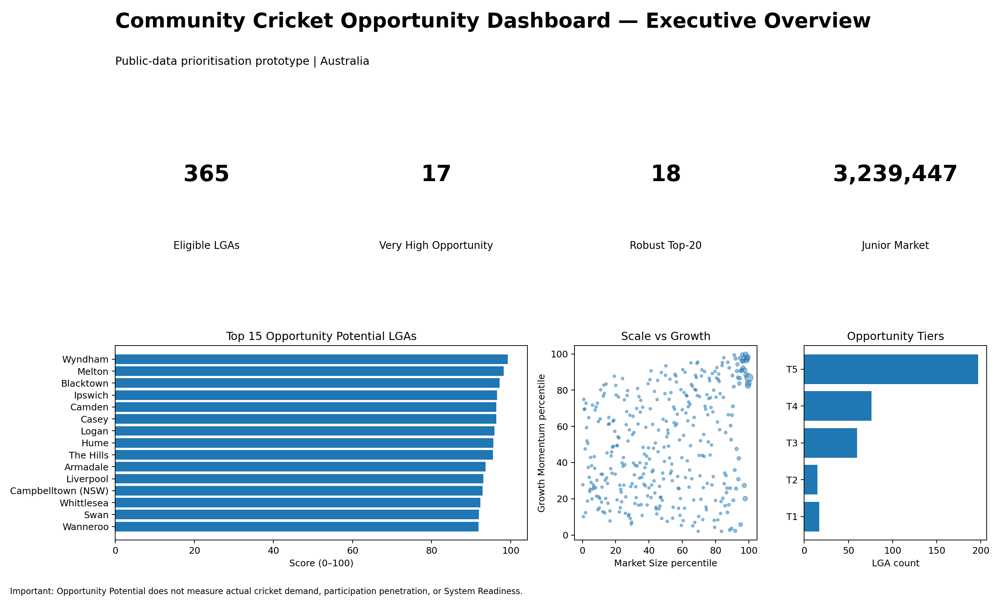
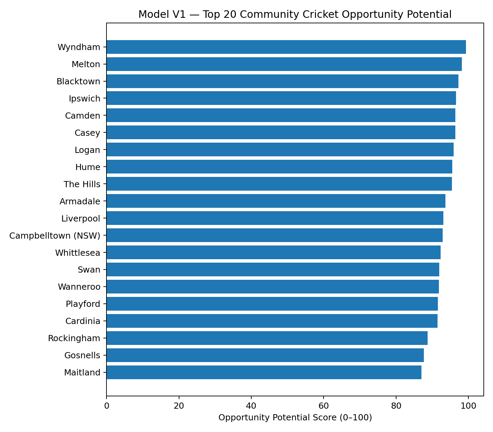
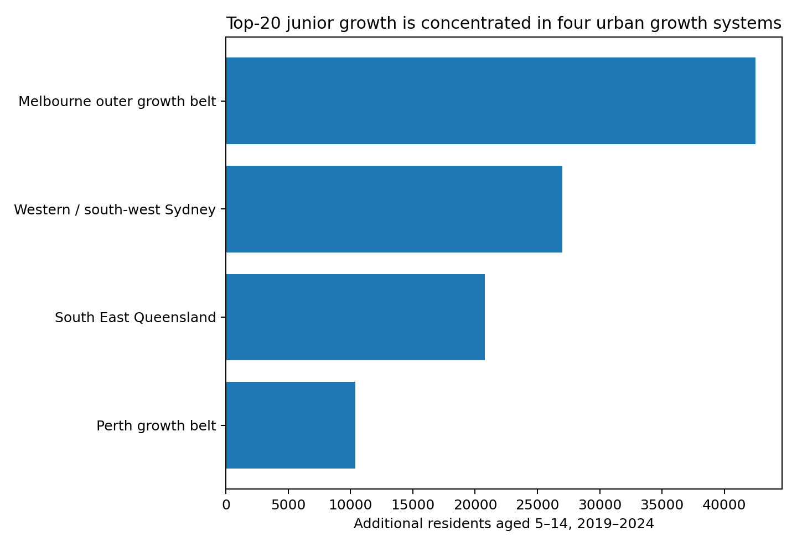
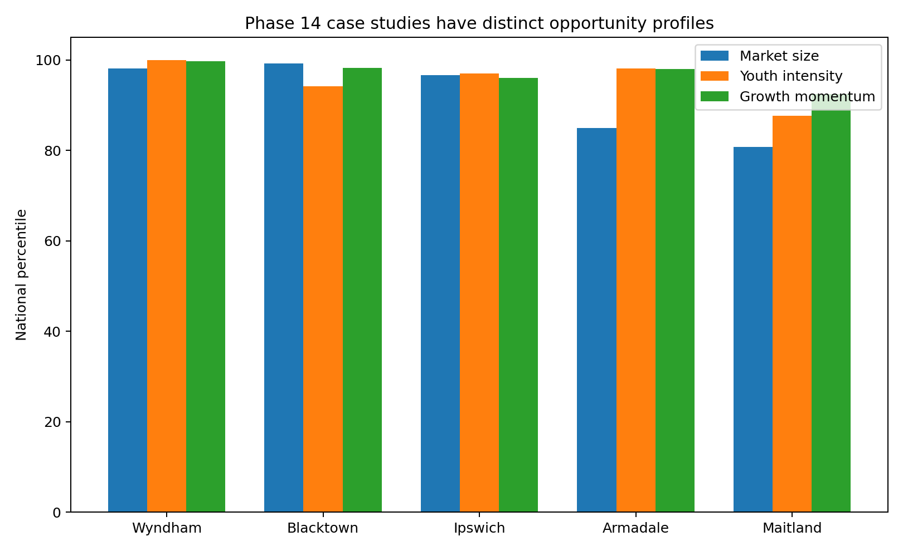

# Where Are Australia's Next Community Cricketers?

**A data-driven analysis of community cricket participation growth opportunities across Australia**

> Public-data decision-support prototype | Australia | 2026



## Recruiter quick view

- **[One-page executive brief](01_executive/Community_Cricket_Opportunity_One_Page_Executive_Brief.pdf)**
- **[Full analytical report](02_final_report/Community_Cricket_Opportunity_Final_Analytical_Report.pdf)**
- **[Dashboard prototype](03_dashboard/Dashboard_Static_Prototype.html)**
- **[Start here](00_start_here/START_HERE.md)**
- **[Key findings](00_start_here/KEY_FINDINGS.md)**

## Business question

If Australian Cricket has limited participation-acquisition resources, **which communities deserve deeper investigation first, and why?**

The project builds a transparent public-data screening model that combines:
1. **Market Size**
2. **Youth Concentration**
3. **Growth Momentum**

It then tests geographic patterns, segments opportunity types, investigates selected high-opportunity LGAs and proposes how Cricket Australia could upgrade the public prototype using internal registration and System Readiness data.

## Headline results

| Result | Finding |
|---|---:|
| Eligible LGAs ranked | **365** |
| Very High Opportunity LGAs | **17** |
| Robust Top-20 LGAs across all weight scenarios | **18** |
| Top-20 junior growth concentrated in four major systems | **94.6%** |
| #1 Model V1 opportunity | **Wyndham, VIC — 99.27** |

### Balanced Model V1 — Top 10

| Rank | LGA | State | Score |
|---:|---|---|---:|
| 1 | Wyndham | VIC | 99.27 |
| 2 | Melton | VIC | 98.22 |
| 3 | Blacktown | NSW | 97.21 |
| 4 | Ipswich | QLD | 96.58 |
| 5 | Camden | NSW | 96.39 |
| 6 | Casey | VIC | 96.39 |
| 7 | Logan | QLD | 95.89 |
| 8 | Hume | VIC | 95.57 |
| 9 | The Hills | NSW | 95.48 |
| 10 | Armadale | WA | 93.65 |



## Strongest analytical findings

### 1. Large population counts are highly redundant
Total LGA population and 5–14 market size have a rank correlation of approximately **0.99**. Raw girls 5–14 and total 5–14 counts are also almost identical ranking signals.

**Model implication:** represent market size once rather than double- or triple-counting the same population-scale effect.

### 2. Junior growth adds different information
Overall population growth and junior-population growth have a rank correlation of only about **0.57**.

**Model implication:** Growth Momentum deserves a separate pillar.

### 3. Opportunity is geographically concentrated
The strongest absolute junior-market growth forms broad systems around:
- outer Melbourne;
- western/south-west Sydney;
- South East Queensland;
- Perth's growth belt.

Those systems account for **94.6%** of the Top-20 absolute junior-population increase.



### 4. Similar opportunity scores can mean different management problems
Phase 14 investigated five cases:

| LGA | Working interpretation |
|---|---|
| Wyndham | Priority acquisition + capacity audit |
| Blacktown | Potential capacity-constrained priority |
| Ipswich | Activate / accelerate around new capacity |
| Armadale | Validate demand before scaling |
| Maitland | Regional growth activation |



## Model V1

For eligible LGAs:

```text
Market Size = percentile rank of current 5–14 population

Youth Concentration = percentile rank of 5–14 share of total population

Growth Momentum =
    50% percentile rank of absolute 2019–2024 5–14 growth
  + 50% percentile rank of percentage 2019–2024 5–14 growth

Opportunity Potential =
    (Market Size + Youth Concentration + Growth Momentum) / 3
```

Equal pillar weights are used because no public LGA-level future-registration outcome exists with which to optimise weights.

### Robustness
Compared with the Balanced Top 20:
- Growth-led weighting: **20/20** overlap
- Scale-led weighting: **18/20**
- Intensity-led weighting: **19/20**

Reasonable eligibility-threshold changes preserve **19–20** of the baseline Top 20.

## Strategic recommendation

The project does **not** recommend that Cricket Australia allocate resources directly from the demographic score.

The recommended process is:

**Opportunity screening → System Readiness diagnosis → Problem classification → Intervention → Outcome measurement**

The production model should add:
- PlayHQ registrations and season histories;
- acquisition, retention and conversion;
- club/program locations;
- facility hours and utilisation;
- waitlists / unmet demand;
- volunteer/workforce capacity;
- participant research;
- women/girls and multicultural strategic overlays.

## Power BI dashboard

The repository contains:
- Power BI-ready CSVs;
- DAX measures;
- Power Query setup;
- theme JSON;
- six-page build specification;
- static HTML prototype.

See [`03_dashboard/`](03_dashboard/).

## Repository structure

```text
community-cricket-opportunity/
├── 00_start_here/          # recruiter entry point and key findings
├── 01_executive/           # one-page brief
├── 02_final_report/        # full 23-page report
├── 03_dashboard/           # Power BI-ready package and preview
├── 04_data/
│   ├── raw_abs/            # unchanged ABS source workbooks
│   ├── processed/          # clean LGA datasets
│   ├── model_outputs/      # EDA, rankings, model, segmentation
│   ├── case_studies/       # Phase 14 evidence
│   ├── validation/         # sensitivity, limitations, KPIs
│   └── source_registers/
├── 05_analysis/charts/     # figures grouped by analytical phase
├── 06_methodology/
│   └── phase_summaries/    # Phase 1–19 documentation
├── 07_src/                 # reproducibility code
└── 08_portfolio_assets/    # images used in README/portfolio
```

## Important limitation

> **Opportunity Potential is a relative demographic prioritisation score. It does not measure actual cricket demand, participation penetration, future registrations, or national Cricket System Readiness.**

This boundary is intentional. The model is designed to identify **where deeper cricket-specific investigation is justified**, not to manufacture certainty from incomplete public data.

## Data and reproducibility

The project uses official public data, primarily from the Australian Bureau of Statistics, plus public strategy and contextual evidence from Australian cricket organisations and selected councils.

See:
- [`04_data/README.md`](04_data/README.md)
- [`04_data/DATA_ATTRIBUTION.md`](04_data/DATA_ATTRIBUTION.md)
- [`07_src/README.md`](07_src/README.md)
- [`06_methodology/phase_summaries/`](06_methodology/phase_summaries/)

## Author

**Md Musa**  
Master of Information Technology, Monash University  
Software Engineering background | Data, research and sports-technology interests

---

### Suggested portfolio link

After you upload this folder to GitHub, your shareable URL will look like:

`https://github.com/<your-username>/community-cricket-opportunity`

Use that repository URL in your resume, LinkedIn Featured section and executive brief.
